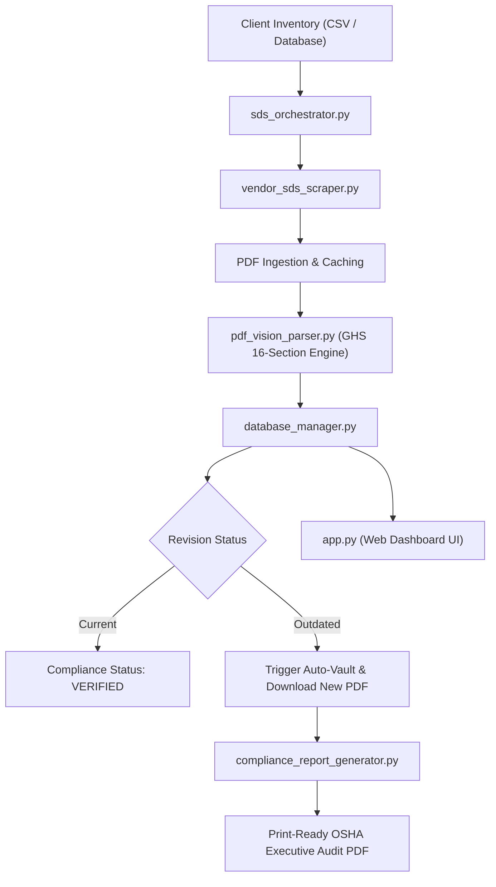

# 🔬 CHEMSAFESYNC: DETAILED TECHNICAL STUDY & PRODUCT SPECIFICATION
**Product:** ChemSafeSync (Material Safety Data Sheet Automated Compliance Engine)  
**Standard Compliance:** OSHA Hazard Communication Standard (29 CFR 1910.1200 / GHS Revision 7)  
**Target Market:** SMB Chemical Distributors, Industrial Manufacturers, Laboratories, Commercial Janitorial Suppliers  

---

## 1. Regulatory Context & OSHA Compliance Architecture

Under OSHA's **Hazard Communication Standard (HCS 2012 / GHS)**, chemical manufacturers, importers, and distributors must supply safety data sheets (SDSs) for every hazardous chemical.

### Key Regulatory Requirements:
1. **16-Section Standardized Format:** OSHA mandates strict 16-section SDS formatting:
   - **Section 1:** Identification (Product Name, CAS/Code, Manufacturer)
   - **Section 2:** Hazard(s) Identification (GHS Signal Words, Pictograms, Hazard Statements)
   - **Section 3:** Composition / Ingredients (CAS Numbers, Concentration)
   - **Section 9:** Physical and Chemical Properties
   - **Section 11:** Toxicological Information
   - **Section 15:** Regulatory Information
2. **Revision Tracking:** When chemical suppliers reformulate products or update toxicity classifications, they issue revised SDS sheets. Employers are legally obligated to replace old sheets with the latest revision date.
3. **Penalties:** Failure to maintain current SDS sheets carries OSHA civil penalties of **$15,625 per non-serious violation** and up to **$156,259 for willful or repeated violations**.

---

## 2. Technical Product Architecture

---

## 3. Product Features & Core API Components

1. **Automated SKU Registry:** Ingests client chemical inventory lists with SKU codes, Product Names, CAS Numbers, and Supplier details.
2. **Vendor Portal Scraper Engine:** Scrapes chemical supplier catalogs (Sigma-Aldrich, Fisher Scientific, McMaster-Carr, Dow, BASF) to locate current SDS documents.
3. **GHS 16-Section Document Parser:** Extracts Product Name, Revision Date, Signal Words (DANGER / WARNING), CAS Registry Numbers, and Hazard Pictograms.
4. **Audit & Compliance Scoring Engine:** Calculates client-level compliance percentage (`Verified SKUs / Total SKUs * 100`).
5. **Executive PDF Report Generator:** Compiles audit findings into a formal Report for Safety & Health Inspectors.
6. **Live Web Control Dashboard:** Web interface to view compliance stats, upload SKU CSVs, trigger live scans, and export audit reports.
